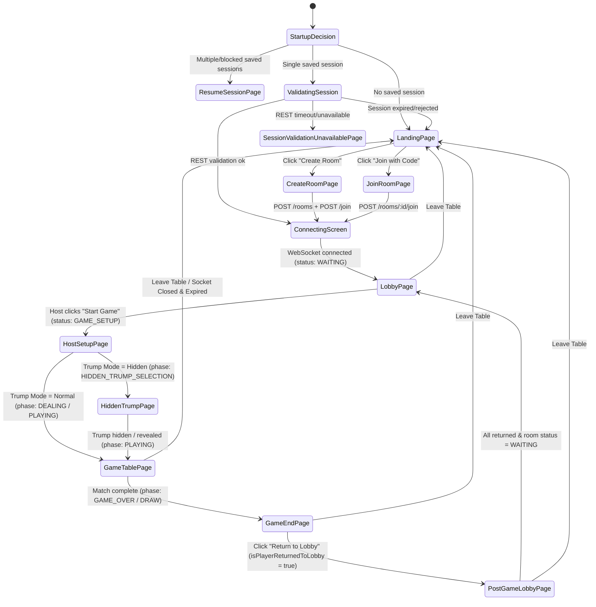

# MendiCot Frontend UI/UX Baseline Reference

> **Baseline Status:** Reference / Good Deployed State  
> **Repository:** `mendicot-bolt-frontend`  
> **Framework & Tooling:** React 18.3.1 · TypeScript 5.5.3 · Vite 5.4.2 · Tailwind CSS 3.4.1 · Lucide Icons 0.344.0  
> **Document Purpose:** Complete, frozen visual and architectural baseline of the frontend user interface and user experience as of current commit. This document serves as the authoritative source of truth for visual regression prevention, responsive layout verification, and design token compliance during future changes.

---

## Table of Contents

1. [Baseline Purpose & Scope](#1-baseline-purpose--scope)
2. [Frontend Architecture & State Machine](#2-frontend-architecture--state-machine)
3. [Global Design System & Tokens](#3-global-design-system--tokens)
4. [Responsive Breakpoints & Viewport Rules](#4-responsive-breakpoints--viewport-rules)
5. [Screen-by-Screen UI Audits](#5-screen-by-screen-ui-audits)
   - [5.1 Landing Page](#51-landing-page)
   - [5.2 Room Creation Page](#52-room-creation-page)
   - [5.3 Room Join Page](#53-room-join-page)
   - [5.4 Saved Session Resume & Validation Screens](#54-saved-session-resume--validation-screens)
   - [5.5 Waiting Lobby Screen](#55-waiting-lobby-screen)
   - [5.6 Host Setup & First-Player Selection Screen](#56-host-setup--first-player-selection-screen)
   - [5.7 Hidden Trump Ceremony Screen](#57-hidden-trump-ceremony-screen)
   - [5.8 Main Gameplay Table Screen](#58-main-gameplay-table-screen)
   - [5.9 Game-End & Results Screen](#59-game-end--results-screen)
   - [5.10 Post-Game Lobby Screen](#510-post-game-lobby-screen)
   - [5.11 Error & Connection Recovery Screens](#511-error--connection-recovery-screens)
6. [4 / 6 / 8 Player Gameplay Table Baseline](#6-4--6--8-player-gameplay-table-baseline)
   - [6.1 Seating Geometry & Relative Seat Rotation](#61-seating-geometry--relative-seat-rotation)
   - [6.2 4-Player Table Mode](#62-4-player-table-mode)
   - [6.3 6-Player Table Mode](#63-6-player-table-mode)
   - [6.4 8-Player Table Mode](#64-8-player-table-mode)
   - [6.5 Central Trick Fan Calculations](#65-central-trick-fan-calculations)
7. [Cards & Hand Interaction Baseline](#7-cards--hand-interaction-baseline)
8. [HUD & Status Components](#8-hud--status-components)
   - [8.1 Scoreboard](#81-scoreboard)
   - [8.2 Current Trick Leader](#82-current-trick-leader)
   - [8.3 Lead Suit Panel](#83-lead-suit-panel)
   - [8.4 Trump Status Panel](#84-trump-status-panel)
   - [8.5 Captured Mendis (Tens) Slots](#85-captured-mendis-tens-slots)
   - [8.6 Hidden Trump Reveal & Card Return Overlays](#86-hidden-trump-reveal--card-return-overlays)
9. [Settings & Turn Alert Notification System](#9-settings--turn-alert-notification-system)
10. [Buttons & Interactive Controls Inventory](#10-buttons--interactive-controls-inventory)
11. [Modals, Toasts & Global Banners](#11-modals-toasts--global-banners)
12. [Page-Fit, Scrolling & Safe-Area Constraints](#12-page-fit-scrolling--safe-area-constraints)
13. [Dynamic & Conditional State Matrix](#13-dynamic--conditional-state-matrix)
14. [Complete Component & File Mapping Directory](#14-complete-component--file-mapping-directory)
15. [Critical UI Invariants Checklist](#15-critical-ui-invariants-checklist)

---

## 1. Baseline Purpose & Scope

This baseline captures the exact runtime UI/UX specifications, styling tokens, responsive boundaries, positioning mathematics, component hierarchies, and visual constraints of the MendiCot frontend.

- **Non-destructive:** No application code was altered to produce this document.
- **Reference Standard:** The UI patterns documented here are the validated standard. Future refactorings, feature additions, or styling passes must preserve these behaviors without regression.
- **Empirical Parameters:** Values recorded are derived directly from Tailwind utility definitions, CSS component layers, calculated positioning helpers, and component unit tests.

---

## 2. Frontend Architecture & State Machine

The client is structured as a reactive single-page state machine in `src/App.tsx`, driving navigation through declarative state transitions backed by WebSocket messages (`ROOM_STATE_UPDATE`, `GAME_STATE_UPDATE`, `ERROR`) and REST endpoints.



### Navigated Screens Enum (`GameScreen` in `src/types.ts`)
1. `'landing'` (`LandingPage.tsx`)
2. `'resume'` (`ResumeSessionPage.tsx`)
3. `'create'` (`CreateRoomPage.tsx`)
4. `'join'` (`JoinRoomPage.tsx`)
5. `'lobby'` (`LobbyPage.tsx`)
6. `'host-setup'` (`HostSetupPage.tsx`)
7. `'hidden-trump'` (`HiddenTrumpPage.tsx`)
8. `'game'` (`GameTablePage.tsx`)
9. `'game-end'` (`GameEndPage.tsx`)
10. `'post-game-lobby'` (`PostGameLobbyPage.tsx`)

### Supplementary Modal & Overlay States
- `'validating-session'` (`ConnectingScreen` with label `"Checking saved session"`)
- `'restoring-session'` (`ConnectingScreen` with label `"Restoring saved session"`)
- `'backend-unavailable'` (`SessionValidationUnavailablePage.tsx`)
- `ErrorScreen` (`ErrorScreens.tsx` with error kinds: `'room-not-found'`, `'room-full'`, `'game-started'`, `'invalid-request'`, `'disconnected'`, `'generic'`)
- `Modal` Settings dialog (`TurnAlertSettings` inside `Modal.tsx`)
- `Modal` Leave Table confirmation dialog
- `Modal` How to Play Info dialog
- `HiddenTrumpRevealOverlay` (`TRUMP_REVEAL_DISPLAY` and `HIDDEN_CARD_RETURN`)
- `ReconnectBanner` (Top bar during `'reconnecting'` and `'offline'`)

---

## 3. Global Design System & Tokens

Defined in `tailwind.config.js` and `src/index.css`.

### 3.1 Color Palette
| Token Family | Hex Values & Names | Usage & Rationale |
| :--- | :--- | :--- |
| **`ink`** (Backgrounds & Surfaces) | `950: #0a0d0b`, `900: #0f1411`, `850: #131814`, `800: #171d18`, `750: #1c241e`, `700: #222b24`, `600: #2b352d`, `500: #364238` | Deep charcoal/near-black forest undertones. Baseline body is `ink-950`. |
| **`ivory`** (Playing Cards) | `50: #fbf8f1`, `100: #f6f1e6`, `200: #ece3d2`, `300: #dccfb5` | Warm physical card face stock. Primary card face is `ivory-50` with `ivory-200` borders. |
| **`emerald`** (Team A / Primary Accent) | `50: #eaf3ee`, `100: #cfe3d6`, `200: #a3c7b1`, `300: #6fa585`, `400: #4a8765`, `500: #356b4d`, `600: #28543d`, `700: #1f4230`, `800: #173325`, `900: #0f2419` | Felt felt table gradient, Team A identity ("Team Maroon"), active turns, primary buttons. |
| **`gold`** (Team B / Special Accents) | `300: #e6c878`, `400: #d4af5a`, `500: #c19a42`, `600: #a8843a`, `700: #8a6c30` | Team B identity ("Team Gold"), host crowns, hidden trump accents, trick winner highlights. |
| **`crimson`** (Red Suit Pips / Danger) | `400: #c44b4b`, `500: #a83838`, `600: #8c2e2e` | Hearts (♥) and Diamonds (♦) card pips, destructive actions (danger button, offline banner). |
| **`bone`** (Neutral Text & Icons) | `50: #f4f1ea`, `100: #e4e0d6`, `200: #c8c2b5`, `300: #a39d8f`, `400: #7a7568`, `500: #565249` | Primary text (`bone-50`), secondary (`bone-100`/`bone-200`), muted eyebrows (`bone-400`). |

### 3.2 Typography Tokens
- **Display Font (`font-display`):** `Fraunces`, `ui-serif`, `Georgia`, `serif` (Google Fonts: 400, 500, 600, 700 weights with variable optical sizing `opsz 9..144`).
- **Body/UI Font (`font-sans`):** `Inter`, `ui-sans-serif`, `system-ui`, `sans-serif` (Google Fonts: 400, 500, 600, 700 weights).
- **Special Features:** `font-feature-settings: 'cv11', 'ss01'` on `<body>`. Antialiasing with `-webkit-font-smoothing: antialiased` and `text-rendering: optimizeLegibility`.
- **Text Sizing Scale:**
  - `text-2xs`: `0.6875rem` (11px), `line-height: 1rem` (16px).
  - `text-xs`: `0.75rem` (12px), `line-height: 1rem` (16px).
  - `text-sm`: `0.875rem` (14px), `line-height: 1.25rem` (20px).
  - `text-base`: `1rem` (16px), `line-height: 1.5rem` (24px).
  - `text-lg`: `1.125rem` (18px), `line-height: 1.75rem` (28px).
  - `text-xl`: `1.25rem` (20px), `line-height: 1.75rem` (28px).
  - `text-2xl`: `1.5rem` (24px), `line-height: 2rem` (32px).
  - `text-3xl`: `1.875rem` (30px), `line-height: 2.25rem` (36px).
  - `text-4xl`: `2.25rem` (36px), `line-height: 2.5rem` (40px).
  - `text-5xl`: `3rem` (48px), `line-height: 1`.
  - `text-7xl`: `4.5rem` (72px), `line-height: 1`.
- **Letter Spacing:**
  - `tracking-tightest`: `-0.04em`
  - `tracking-brand`: `-0.02em`
  - `label-eyebrow`: `uppercase tracking-[0.18em]` (or `[0.12em]` - `[0.14em]`)

### 3.3 Component Layer Classes (`src/index.css`)
- `.surface`: `bg-ink-850 border border-ink-700 rounded-xl`
- `.surface-raised`: `bg-ink-800 border border-ink-600 rounded-xl shadow-card`
- `.surface-inset`: `bg-ink-900 border border-ink-700 rounded-xl`
- `.table-felt`: `radial-gradient(ellipse at center, #1f4230 0%, #173325 55%, #0f2419 100%)`
- `.table-rim`: `linear-gradient(180deg, #2b352d 0%, #1c241e 100%)` with `inset 0 2px 0 rgba(255, 255, 255, 0.05), inset 0 -2px 0 rgba(0, 0, 0, 0.4), 0 8px 32px rgba(0, 0, 0, 0.5)`
- `.label-eyebrow`: `text-2xs font-medium uppercase tracking-[0.18em] text-bone-400`
- `.hairline`: `border-ink-700`
- `.focus-ring`: `focus-visible:outline-none focus-visible:ring-2 focus-visible:ring-emerald-400/70 focus-visible:ring-offset-2 focus-visible:ring-offset-ink-950`
- `.no-tap-highlight`: `-webkit-tap-highlight-color: transparent`
- `.scrollbar-thin`: `::-webkit-scrollbar { height: 6px; width: 6px; }`, `::-webkit-scrollbar-thumb { background: rgba(255, 255, 255, 0.12); border-radius: 999px; }`

### 3.4 Shadows
- `shadow-card`: `0 2px 4px rgba(0,0,0,0.35), 0 1px 2px rgba(0,0,0,0.25)`
- `shadow-card-lift`: `0 12px 24px rgba(0,0,0,0.45), 0 4px 8px rgba(0,0,0,0.3)`
- `shadow-card-played`: `0 8px 18px rgba(0,0,0,0.5), 0 2px 6px rgba(0,0,0,0.35)`
- `shadow-inset`: `inset 0 1px 2px rgba(0,0,0,0.4)`
- `shadow-inner-soft`: `inset 0 1px 0 rgba(255,255,255,0.04)`
- `shadow-glow`: `0 0 0 1px rgba(212,175,90,0.4), 0 0 18px rgba(212,175,90,0.18)`
- `shadow-turn`: `0 0 0 2px rgba(74,135,101,0.7), 0 0 22px rgba(74,135,101,0.35)`

### 3.5 Keyframe Animations
- `fade-in`: `0% { opacity: 0; } 100% { opacity: 1; }` (`0.3s ease-out both`)
- `fade-up`: `0% { opacity: 0; transform: translateY(8px); } 100% { opacity: 1; transform: translateY(0); }` (`0.35s ease-out both`)
- `scale-in`: `0% { opacity: 0; transform: scale(0.96); } 100% { opacity: 1; transform: scale(1); }` (`0.25s ease-out both`)
- `slide-up`: `0% { opacity: 0; transform: translateY(100%); } 100% { opacity: 1; transform: translateY(0); }` (`0.3s ease-out both`)
- `slide-down`: `0% { opacity: 0; transform: translateY(-100%); } 100% { opacity: 1; transform: translateY(0); }` (`0.3s ease-out both`)
- `pulse-soft`: `0%, 100% { opacity: 1; } 50% { opacity: 0.55; }` (`2s ease-in-out infinite`)
- `card-play`: `0% { opacity: 0; transform: translateY(24px) scale(0.92); } 100% { opacity: 1; transform: translateY(0) scale(1); }` (`0.3s cubic-bezier(0.22,1,0.36,1) both`)
- `reveal`: `0% { transform: rotateY(90deg); opacity: 0; } 100% { transform: rotateY(0deg); opacity: 1; }` (`0.4s ease-out both`)

---

## 4. Responsive Breakpoints & Viewport Rules

The project uses Tailwind's default breakpoints with one custom inline media query:

| Breakpoint | Minimum Width | Core Adaptations |
| :--- | :--- | :--- |
| **Base** | `< 375px` | Ultra-compact switches (`min-[375px]:inline` hides "Turn Alerts" text below 375px). Mobile side seats stack in upper edge row (`absolute left-1/right-1 top-3 max-w-[46%]`). Trick cards area reserves lower `pt-28`. Mobile status bar appears below TopBar. Hand uses `-ml-11`. |
| **`min-[375px]`** | `375px` | "Turn Alerts" label appears next to bell icon in header quick control. |
| **`sm`** | `640px` | Header padding expands `px-4` -> `px-6`. Buttons switch from stacked `fullWidth` to inline horizontal rows (`flex-col` -> `sm:flex-row`). Modal max height `calc(100dvh - 2rem)`. |
| **`md`** | `768px` | Lobby team panels split into a 2-column grid (`grid-cols-1 md:grid-cols-2`). Hand overlap relaxes to `md:-ml-7`. |
| **`lg`** | `1024px` | Desktop gameplay layout activates. Mobile status bar hides (`lg:hidden`). Dedicated 72-rem HUD sidebar (`w-72 shrink-0`) mounts on right. Side player seats move to left and right columns flanking the center trick. Top table seats expand `lg:pt-12`. Corner trick & turn badges appear. |

### Viewport Combinations & Safe Heights
- **Mobile Handsets (320×568 to 430×932):** Viewport utilizes `100dvh` in modal bounds (`max-h-[calc(100dvh-1.5rem)]`). Global `overflow-x: hidden` on `html, body` prevents mobile bouncing. Hand cards fit inside single row via negative margins without horizontal page scrolling.
- **Laptops (1366×768, 1440×900):** Table area expands vertically (`min-h-0` in `lg:flex-row`). Hand tray remains docked at bottom (`border-t hairline bg-ink-950/90 backdrop-blur-sm z-20`) with 48px to 64px vertical clearance from table rim.
- **Desktops (1920×1080):** Centered max container `max-w-6xl` (1152px) with ample margins.

---

## 5. Screen-by-Screen UI Audits

### 5.1 Landing Page (`LandingPage.tsx`)
- **Outer Shell:** `relative min-h-screen overflow-hidden` with 3-layer decorative background (`.table-felt opacity-40`, vertical gradient `from-ink-950/60 via-transparent to-ink-950`, and a 32px dotted radial grid overlay `opacity-[0.04]`).
- **Navigation Bar:** `h-16 max-w-6xl px-4 sm:px-6` with `Logo size={30}` and action buttons: Ghost "Join Room" + Primary "Create Room".
- **Hero Section:** `pt-12 sm:pt-16 md:pt-24 text-center max-w-6xl`.
  - Pill Badge: `rounded-full border border-ink-600 bg-ink-900/60 px-3 py-1 text-2xs uppercase tracking-[0.18em]` with pulsating emerald dot.
  - Mark: `LogoMark size={72}`.
  - Headline: `font-display text-4xl sm:text-5xl md:text-7xl font-semibold tracking-tightest text-bone-50 text-balance`.
  - CTAs: Large Primary Button "Create a Room" with arrow icon (`group-hover:translate-x-0.5`) + Large Secondary Button "Join with Code".
  - Chips: "4 · 6 · 8 players" (Users icon) and "Two teams" (Zap icon) separated by `h-4 w-px bg-ink-600`.
- **How It Works Grid:** 3-column split (`sm:grid-cols-3`) inside `rounded-2xl border hairline bg-ink-700 gap-px` (Cards: 01 Create or join, 02 Pick your mode, 03 Play the hand).
- **Footer:** `border-t hairline px-4 sm:px-6 py-6 text-2xs uppercase tracking-[0.14em] text-bone-500`.

### 5.2 Room Creation Page (`CreateRoomPage.tsx`)
- **Container:** `max-w-2xl px-4 sm:px-6 py-8 sm:py-12 mx-auto`.
- **Form Controls:**
  - Display Name: `Field` + `TextInput` (2-20 characters, autofocus, validation on blur).
  - Player Count Selector: 3-column button grid (`4` Classic, `6` Six-hand, `8` Full table) with active emerald ring (`ring-1 ring-emerald-400/40 bg-emerald-900/30`) and check icon.
  - Trump Mode Selector: 2-column card grid (`Normal Trump` with Eye icon vs `Hidden Trump` with EyeOff icon).
  - Action Row: Primary Button "Create Room" (`size="lg" fullWidth sm:flex-1`) + Ghost "Cancel" (`size="lg" sm:w-auto`).

### 5.3 Room Join Page (`JoinRoomPage.tsx`)
- **Container:** `max-w-md px-4 sm:px-6 py-8 sm:py-12 mx-auto`.
- **Form Controls:**
  - Room Code Input: 8-character normalized uppercase tracking `tracking-[0.3em] uppercase text-center font-display` (`TextInput`).
  - Display Name Input: 2-20 characters.
  - Join Button: Large Primary "Join Room" (with spinner during 700ms simulated connection transition).
  - Secondary Back Link: "Don't have a code? Create a room".

### 5.4 Saved Session Resume & Validation Screens (`ResumeSessionPage.tsx`)
- **ResumeSessionPage:**
  - Header: Centered `Logo size={34}` over `.table-felt` backdrop.
  - Card: `.surface-raised p-5 sm:p-7 max-w-xl`.
  - Blocked Tab Warning Banner: Gold bordered callout (`bg-gold-700/10 border-gold-500/40`) with explicit "Take Over" gold button when tab collision occurs.
  - Session Choice Rows: Rounded cards displaying player display name, room ID, Primary "Resume" button, and Ghost "Forget" (Trash2 icon) button.
  - Cancel Button: Full-width ghost button "Start without resuming".
- **SessionRestoreNotice:**
  - Floating banner (`fixed left-1/2 top-5 z-50 w-[calc(100%-2rem)] max-w-md -translate-x-1/2`) or inline block with gold warning alert icon for `'session-expired'`, `'room-closed'`, and `'session-invalid'`. Auto-dismisses after 6000ms.
- **SessionValidationUnavailablePage:**
  - Centered card (`max-w-md .surface-raised p-6 sm:p-8`) with gold AlertTriangle icon, "Backend Unavailable" heading, "Retry" primary button, and "Back" secondary button.

### 5.5 Waiting Lobby Screen (`LobbyPage.tsx`)
- **Header Section:**
  - Title: "Your table is ready" (Host) / "Waiting for the host" (Peer).
  - Subtitle: "X of Y players online · Z ready".
  - Right Block: Centered/Responsive `RoomCodeDisplay size="md"` + "Switch Team" Secondary Button (height: 44px on mobile `h-11 w-full sm:h-9 sm:w-auto`).
  - Action Error Message: `rounded-lg border border-crimson-500/40 bg-crimson-500/10 px-3 py-2 text-sm text-crimson-400`.
- **Config Chips:** 3 pill badges ("X players", "Normal/Hidden Trump", "Best of 13 tricks").
- **Team Panels Grid:** 2-column grid (`grid-cols-1 md:grid-cols-2 gap-4`).
  - Header: `InlineTeamName` with team color dot + "X / Y seated" indicator.
  - Player Rows: Avatar with online dot, display name, Crown icon for host, `StatusIndicator`, and Ready/Waiting badge.
  - Empty Seats: Dashed box (`border-dashed border-ink-600 text-bone-500`) with UserPlus icon and "Empty seat" text.
  - Double-Click / Double-Tap Team Renaming: `InlineTeamName.tsx` supports double-click or double-tap within `320ms` window on mobile devices.
- **Host Control Bar:** `.surface-raised p-5` with "Ready to deal" / "Not ready to start" status and Large Primary "Start Game" button (Host) or pulsing gold dot "The host will start the game" (Peer).

### 5.6 Host Setup & First-Player Selection Screen (`HostSetupPage.tsx`)
- **Header:** TopBar with gold crown "Host setup" badge.
- **Heading Area:** "Who plays first?" (Normal Trump) or "Who hides the trump?" (Hidden Trump pre-selection).
- **Player Selector Grid:** 4-column responsive grid (`grid-cols-2 sm:grid-cols-4 gap-3`).
  - `SelectablePlayer`: Large Avatar (`size="lg"`), Player display name, `TeamBadge`, hover check icon overlay (`group-hover:opacity-100`).
- **Non-Host View:** `.surface-raised p-5` reading "The host will choose the opening player for everyone."
- **Cancel Button:** Ghost "Back" button allowing host to return to the waiting lobby during `FIRST_PLAYER_SELECTION`.

### 5.7 Hidden Trump Ceremony Screen (`HiddenTrumpPage.tsx`)
- **Hider Card Selection Mode (Active Hider):**
  - Title: "Choose the trump card" with gold eyebrow "Your secret move".
  - Grid of Face-down Cards: Responsive grid (`grid-cols-3 sm:grid-cols-4 md:grid-cols-6 gap-3 sm:gap-4 max-w-2xl mx-auto`).
  - Cards: `w-16 h-24 sm:w-20 sm:h-28` emerald gradient card backs with gold star notch (`✦`).
  - Selected state: `-translate-y-2 border-gold-400 bg-emerald-800 shadow-card-lift ring-2 ring-gold-400`.
  - Confirmation Footer: "Tap a card to select it" -> "Card selected — confirm to hide the trump" + Large Primary "Hide Trump" button with Sparkles icon.
- **Waiting Mode (Non-Hiders & Hider Post-Selection):**
  - Centered presentation (`max-w-2xl py-16 text-center`) with large avatar, EyeOff badge, and pulsing status "Waiting for selection…".
  - Hider Post-Selection View: "Your trump is selected" with "Continue to table" button.

### 5.8 Main Gameplay Table Screen (`GameTablePage.tsx`)
- **Zone 1: Top Navigation Bar:**
  - `TopBar` with `showLogo={false}`, `TurnAlertQuickControl` (compact 44px tap switch), Info button (opens How to Play modal), and Leave button (opens confirm leave modal).
- **Zone 2A: Mobile Status Bar (`lg:hidden`):**
  - Horizontal wrap strip below TopBar containing `TrumpStatus compact`, `Scoreboard compact`, and `CurrentTrickLeader compact`.
- **Zone 2B: Table Felt Area (`TableArea`):**
  - Felt container with `.table-rim` (1.75rem rounded border) and `.table-felt` (1.4rem inner radius) with radial gradient and watermark "M".
  - Table height rules: 8-player (`min-h-[34rem]`), 6-player (`min-h-[30rem]`), 4-player (`min-h-[26rem]`).
  - Desktop: Top seats flex row, Left seats column, Center trick pile, Right seats column. Top-left corner `TrickBadge`, top-right corner `TurnBadge`.
  - Mobile: Top seats flex row, MobileTableStatus strip, Upper Edge Side Seats (`absolute left-1/right-1 top-3 max-w-[46%]`), and Lower Trick Area (`pt-28 pb-2 items-end`).
- **Zone 2C: Desktop HUD Column (`hidden lg:flex w-72 shrink-0 flex-col gap-3`):**
  - Scoreboard (with win progress bars) -> Current Trick Leader -> Lead Suit Panel -> Trump Status.
- **Zone 3: Bottom Player Hand Tray:**
  - Separated footer tray (`border-t hairline bg-ink-950/90 backdrop-blur-sm z-20 px-3 py-3 sm:py-4`).
  - Header: "Your hand · X cards" + Turn indicator badge (pulsing green "Your turn — select a card" / pulsing gold "Resolving trick…" / "Waiting for [Name]").
  - Hand: `CardHand` component with tight overlap.
  - Action Row: "Play selected card" button (`Button size="md"`) + "Reveal trump" button (secondary variant, shown only when player cannot follow lead suit and hidden trump is active).

### 5.9 Game-End & Results Screen (`GameEndPage.tsx`)
- **Header:** Trophy circle (emerald for Team A win, gold for Team B win) + "Victory" / "Defeat" / "Draw" title.
- **Team Comparison Grid:** 2-column split (`sm:grid-cols-2 gap-px rounded-2xl border hairline bg-ink-700`) with team badges, trick counts (`font-display text-3xl`), and captured Mendis suit slots.
- **Player Summary Grid:** 4-column cards (`grid-cols-2 sm:grid-cols-4 gap-3`) displaying each player's avatar, team badge, and "Winner" / "Runner-up" / "Draw" label.
- **Action Buttons:** Large Primary "Return to Lobby" (ArrowLeftToLine icon) + Large Danger "Leave Table" (LogOut icon).
- **Pending/Error State:** Shows semantic `role="status"` "Returning to lobby…" or `role="alert"` error message below action buttons without unmounting results.

### 5.10 Post-Game Lobby Screen (`PostGameLobbyPage.tsx`)
- **Header:** "Waiting for the next game", "Waiting for other players to return before the next game can start", and "X of Y players are in the lobby" live status.
- **Room Code:** Centered `RoomCodeDisplay size="md"`.
- **Team Status Panels:** 2-column grid (`grid-cols-1 md:grid-cols-2 gap-4`).
  - Player Rows: Display name, Avatar, Crown icon for host, StatusIndicator, and Status Badges:
    - `In Lobby`: Emerald check icon (`text-emerald-300`).
    - `Still in the Game`: Gold hourglass icon (`text-gold-300`).
    - `Offline`: Dimmed row (`opacity-70 text-bone-400`).
  - Empty Seats: "Awaiting return" placeholder with Hourglass icon.
- **Action Row:** Large Danger "Leave Table" button (`size="lg" sm:w-auto sm:min-w-52`).
- **Footer Note:** "The game will restart once every remaining player has returned." (Host-only reminder).

### 5.11 Error & Connection Recovery Screens (`ErrorScreens.tsx`)
- **Container:** Centered presentation (`max-w-md px-6 text-center min-h-screen flex flex-col`).
- **Icons & Color:** 56px circle with crimson icon (`border-crimson-500/30 bg-crimson-500/10 text-crimson-400`).
- **Error Variants:**
  - `room-not-found`: "Incorrect Room Code" / "Please check the room code and try again."
  - `room-full`: "Room is full" / "All seats at this table are taken. Ask the host to make room or try another code."
  - `game-started`: "Game already started" / "This table is mid-game. You can join the next round once it ends."
  - `invalid-request`: "Invalid request" / "Please check the room code and your display name, then try again."
  - `disconnected`: "You went offline" / "Your connection dropped. Try reconnecting to rejoin the table." (Offers "Try again" + "Back to home").
  - `generic`: "Something went wrong" / "An unexpected error occurred. Please try again."
- **ConnectingScreen:** Pulsing `LogoMark size={56}` with title "Connecting to the room" and subtitle "Setting up your seat at the table."

---

## 6. 4 / 6 / 8 Player Gameplay Table Baseline

### 6.1 Seating Geometry & Relative Seat Rotation
The table dynamically computes visual positions from the local player's perspective using `getRelativeSeating()` in `src/components/game/tableLayout.ts`.

- **Anchor Rule:** The local player (`meId`) is **always relative seat 0**, rendered in the bottom hand tray.
- **Clockwise Rotation Formula:**  
  $$\text{relativeSeat} = ((\text{player.seatIndex} - \text{me.seatIndex}) \pmod N + N) \pmod N$$  
  where $N \in \{4, 6, 8\}$ is `playerCount`.
- **Seat Assignment Maps:**

| Total Players | Relative Seat 0 (Bottom) | Relative Seat 1 | Relative Seat 2 | Relative Seat 3 | Relative Seat 4 | Relative Seat 5 | Relative Seat 6 | Relative Seat 7 |
| :--- | :--- | :--- | :--- | :--- | :--- | :--- | :--- | :--- |
| **4 Players** | Me (Hand) | Left | Top (Teammate) | Right | — | — | — | — |
| **6 Players** | Me (Hand) | Left 1 | Left 2 | Top 1 (Teammate) | Top 2 | Right 1 | — | — |
| **8 Players** | Me (Hand) | Left 1 | Left 2 | Top 1 | Top 2 (Teammate) | Top 3 | Right 1 | Right 2 |

### 6.2 4-Player Table Mode
- **Cards Dealt Per Player:** 12 cards.
- **Table Min-Height:** `min-h-[26rem] sm:min-h-[26rem] lg:min-h-0`.
- **Top Seats:** 1 player (`topPlayers.length === 1`), centered.
- **Left / Right Seats:** 1 player on Left, 1 player on Right.
- **Teammate Alignment:** Exactly opposite across the table at Relative Seat 2 (Top).
- **Central Played Trick Offset:** Default `34px` horizontal fan overlap.

### 6.3 6-Player Table Mode
- **Cards Dealt Per Player:** 8 cards.
- **Table Min-Height:** `min-h-[30rem] sm:min-h-[30rem] lg:min-h-0` (increased to prevent vertical collision of stacked side seats).
- **Top Seats:** 2 players (`topPlayers.length === 2`), side by side with `gap-2 sm:gap-3`.
- **Left / Right Seats:** 2 players on Left (rendered top-to-bottom via `.reverse()`), 1 player on Right.
- **Teammate Alignment:** Relative Seat 3 (Top 1).
- **Central Played Trick Offset:** Default `26px` horizontal fan overlap.

### 6.4 8-Player Table Mode
- **Cards Dealt Per Player:** 6 cards.
- **Table Min-Height:** `min-h-[34rem] sm:min-h-[34rem] lg:min-h-0` (maximum height to accommodate double side stacks and 3 top seats).
- **Top Seats:** 3 players (`topPlayers.length === 3`), distributed across the wide top rim.
- **Left / Right Seats:** 2 players on Left, 2 players on Right.
- **Teammate Alignment:** Relative Seat 4 (Top 2 / Center Top).
- **Central Played Trick Offset:** Default `20px` horizontal fan overlap.

### 6.5 Central Trick Fan Calculations (`CurrentTrick.tsx`)
Played cards are displayed as a centered horizontal fan:
- **Card Dimensions:** $W = 64\text{px}$ (`w-16`), $H = 96\text{px}$ (`h-24`).
- **Container Measurement:** Monitored via `ResizeObserver` on `containerW`.
- **Fan Width Formula:**  
  $$\text{pileW} = W + (n - 1) \times \text{offsetX}$$
- **Auto-compression Algorithm:** If $\text{pileW} > \text{containerW}$,  
  $$\text{offsetX} = \max\left(14\text{px}, \left\lfloor \frac{\text{containerW} - W}{n - 1} \right\rfloor\right)$$
  *(Floor at 14px guarantees the top-left rank + suit pip corner is always visible on every card).*
- **Winning Card Highlight:** When `phase === 'TRICK_RESOLUTION'`, the winning card receives `ring-2 ring-gold-400 ring-offset-2 ring-offset-ink-950`.

---

## 7. Cards & Hand Interaction Baseline

### 7.1 Card Dimensions (`PlayingCard.tsx`)
| Size Token | Width | Height | Rank Font | Suit Font | Corner Font |
| :--- | :--- | :--- | :--- | :--- | :--- |
| **`sm`** | `w-11` (44px) | `h-16` (64px) | `text-sm` (14px) | `text-xs` (12px) | `text-2xs` (11px) |
| **`md`** (Default) | `w-16` (64px) | `h-24` (96px) | `text-lg` (18px) | `text-sm` (14px) | `text-2xs` (11px) |
| **`lg`** | `w-20` (80px) | `h-28` (112px) | `text-xl` (20px) | `text-base` (16px) | `text-xs` (12px) |

### 7.2 Card Visual States
- **`default`:** Border `ivory-200`, background `ivory-50`, shadow `shadow-card`.
- **`playable`:** Border `emerald-500/50`, cursor `cursor-pointer`, hover `-translate-y-1.5 hover:border-emerald-400 hover:shadow-card-lift`.
- **`unplayable` / `dimmed`:** Border `ink-300/40`, opacity `opacity-50`, cursor `cursor-not-allowed`, native tooltip with rule explanation (e.g. *"You must follow spades."*).
- **`selected`:** Translation `-translate-y-3`, border `emerald-500`, shadow `shadow-card-lift`, ring `ring-2 ring-emerald-400/50`.
- **`face-down`:** Gradient `from-emerald-800 to-emerald-900`, inner gold border with star notch `✦`.

### 7.3 Hand Overlap Rules (`CardHand.tsx`)
Cards are stacked horizontally with progressive negative margins:
- **Compact Hand (Mobile default):** `-ml-11 sm:-ml-8 md:-ml-7`
- **Standard Hand:** `-ml-8 md:-ml-7`
- **Large Hand:** `-ml-7 sm:-ml-8 md:-ml-9`
- **Layering:** Z-index increases left-to-right (`zIndex: i`), matching dealing order. First card has `margin-left: 0`.

---

## 8. HUD & Status Components

### 8.1 Scoreboard (`Scoreboard.tsx`)
- **Desktop Sidebar:** 2-column panel (`surface rounded-xl p-3`). Shows Team A vs Team B.
  - Crown icon for leading team.
  - Numeric Tricks won (`font-display font-semibold text-2xl`).
  - Captured Mendis (Tens) 4-suit symbol slots.
  - Progress bars: Tricks won towards 7 (`bg-emerald-500` / `bg-gold-500`), Tens captured towards 3.
- **Mobile Compact Mode (`compact`):** `p-2`, condensed text (`text-xl sm:text-2xl`), hides linear progress bars to save vertical space.

### 8.2 Current Trick Leader (`CurrentTrickLeader.tsx`)
- **Container:** `.surface px-3 py-2.5` with team accent border (`border-crimson-500/40` for Team A / `border-gold-500/40` for Team B).
- **Content:** Team color dot, Player display name (`font-display text-sm font-semibold`), winning card rank and suit name (`text-crimson-400` for red / `text-bone-100` for black). Empty state: *"No cards played yet"*.

### 8.3 Lead Suit Panel (`LeadSuitPanel.tsx`)
- **Container:** `.surface px-3 py-2.5 border-ink-700`.
- **Content:** Eyebrow *"Lead Suit"* + symbol and name (e.g. `♠ Spades`) or *"Not set"*.

### 8.4 Trump Status Panel (`TrumpStatus.tsx`)
- **No Trump:** HelpCircle icon + *"No trump yet"*.
- **Hidden Trump:** EyeOff icon + pulsing gold border + *"Hidden — waiting for reveal"*.
- **Revealed Trump:** Eye icon + emerald border + oversized suit symbol & uppercase suit name.
- **Created Trump:** Sparkles icon + gold border + suit symbol & uppercase name.

### 8.5 Captured Mendis (Tens) Slots (`CapturedMendisSlots.tsx`)
- **Layout:** 4-column grid `grid-cols-[repeat(4,minmax(0,1fr))]` in fixed suit order:
  1. `♠ Spades` (`text-bone-50`)
  2. `♥ Hearts` (`text-crimson-400`)
  3. `♦ Diamonds` (`text-crimson-400`)
  4. `♣ Clubs` (`text-bone-50`)
- **Uncaptured Slot:** Displays a muted dot `·` (`text-bone-500 opacity-40`).
- **Accessibility:** Generates human-readable descriptions (e.g., *"Team Maroon captured ten of Spades and ten of Hearts"*).

### 8.6 Hidden Trump Reveal & Card Return Overlays (`HiddenTrumpRevealOverlay.tsx`)
- **Reveal Display (`TRUMP_REVEAL_DISPLAY`):** Full-table centered overlay (`bg-ink-950/95 p-6 rounded-2xl shadow-2xl ring-1 ring-white/10 backdrop-blur-md animate-fade-in motion-safe:animate-scale-up`). Displays *"TRUMP REVEALED"* + suit symbol and uppercase suit name.
- **Card Return Display (`HIDDEN_CARD_RETURN`):** Centered card back with animation `motion-safe:animate-translate-up` and pill badge: *"Hidden card returned"* (to hider) or *"Hidden card returned to [HiderName]"* (to others).

---

## 9. Settings & Turn Alert Notification System

Configured via `TurnAlertControls.tsx`, `useTurnAlertReminder.ts`, and `turnAlertSound.ts`.

### 9.1 Storage & Scoping
- **Storage Key:** `mendicot.turnAlerts.v2:${scope}` in `localStorage` (scoped by session key/tab).
- **Default State:** `{ enabled: true, sound: 'soft-chime' }`.

### 9.2 Turn Alert Toggle Switches
- **Standard Settings Switch (`TurnAlertSwitch`):**
  - Track: `h-7 w-[52px]` rounded-full (`bg-emerald-500 ring-emerald-400/70` on / `bg-ink-900 ring-ink-600` off).
  - Thumb: `h-[22px] w-[22px]` (`left-[27px]` on / `left-[3px]` off).
  - Label: "ON" / "OFF" (`text-xs font-semibold uppercase`).
- **Header Quick Control Switch (`compact`):**
  - Touch Target: `h-11 shrink-0` (44px tap area).
  - Track: `h-5 w-9` (`bg-emerald-500` on / `bg-ink-900` off).
  - Thumb: `h-4 w-4` (`left-[18px]` on / `left-0.5` off).
  - Label: Hidden below 375px (`hidden min-[375px]:inline text-[10px] uppercase`).

### 9.3 Sound Synthesis (Web Audio API)
Locally synthesized using oscillator tones with master gain limiting:
- **`soft-chime` (Default):** Dual sine partials at 659.25Hz and 987.77Hz.
- **`wooden-click`:** Triangle 185Hz with fast attack (4ms) + sine 112Hz & 370Hz.
- **`subtle-bell`:** Sine partials at 880Hz and 1320Hz.

### 9.4 Push & Browser Notification Permissions
- **Status Labels:** `Enabled`, `Not enabled`, `Blocked`, `Unsupported`.
- **Action:** Explicit "Enable Notifications" button triggers native `Notification.requestPermission()`.
- **Haptic Vibration:** Falls back to `navigator.vibrate([200, 100, 200])` when tab is backgrounded.

---

## 10. Buttons & Interactive Controls Inventory

All interactive buttons adhere to standard variant and size classes (`src/components/ui/Button.tsx`):

| Variant | Classes & Visual Appearance |
| :--- | :--- |
| **`primary`** | `bg-emerald-500 text-ink-950 hover:bg-emerald-400 active:bg-emerald-600 border border-emerald-400/50 shadow-[0_1px_0_rgba(255,255,255,0.15)_inset]` |
| **`secondary`** | `bg-ink-700 text-bone-50 hover:bg-ink-600 active:bg-ink-800 border border-ink-600` |
| **`ghost`** | `bg-transparent text-bone-200 hover:bg-ink-800 hover:text-bone-50 border border-transparent` |
| **`gold`** | `bg-gold-500 text-ink-950 hover:bg-gold-400 active:bg-gold-600 border border-gold-400/50 shadow-[0_1px_0_rgba(255,255,255,0.2)_inset]` |
| **`danger`** | `bg-crimson-500/15 text-crimson-400 hover:bg-crimson-500/25 border border-crimson-500/40` |

| Size | Height / Padding / Radius | Touch Target |
| :--- | :--- | :--- |
| **`sm`** | `h-9 px-3.5 text-sm rounded-lg gap-1.5` | 36px height (minimum desktop compact) |
| **`md`** | `h-11 px-5 text-sm rounded-lg gap-2` | 44px height (Apple/WCAG standard mobile touch target) |
| **`lg`** | `h-13 px-7 text-base rounded-xl gap-2.5 py-3.5` | 52px height (Primary ceremony and game end actions) |

### Comprehensive Controls Inventory
| Control Name | Screen | Variant | Size | Responsiveness / Wrapping |
| :--- | :--- | :--- | :--- | :--- |
| **Create Room (Nav)** | Landing | `primary` | `sm` | In header, stays inline |
| **Join Room (Nav)** | Landing | `ghost` | `sm` | In header, stays inline |
| **Create a Room (Hero)** | Landing | `primary` | `lg` | Stacks full-width on mobile, inline on `sm` |
| **Join with Code (Hero)**| Landing | `secondary`| `lg` | Stacks full-width on mobile, inline on `sm` |
| **Create Room (Submit)** | Create | `primary` | `lg` | Full-width on mobile, `sm:flex-1` |
| **Cancel (Create)** | Create | `ghost` | `lg` | Full-width on mobile, `sm:w-auto` |
| **Join Room (Submit)** | Join | `primary` | `lg` | Full-width |
| **Switch Team** | Lobby | `secondary`| `sm` | `h-11 w-full sm:h-9 sm:w-auto` |
| **Start Game** | Lobby | `primary` | `lg` | Full-width on mobile, inline on `sm` |
| **Settings (Header)** | Lobby | `ghost` | `sm` | In header |
| **Leave (Header)** | Lobby | `ghost` | `sm` | In header |
| **First Player Card** | Host Setup | custom card | custom | 2-col on mobile, 4-col on `sm` |
| **Back (Host Setup)** | Host Setup | `ghost` | `md` | Bottom left |
| **Hide Trump (Submit)** | Hidden Trump| `primary` | `lg` | Full-width on mobile, inline on `sm` |
| **Continue to table** | Hidden Trump| `primary` | `md` | Centered |
| **Play selected card** | Game Table | `primary` | `md` | Centered in hand action row |
| **Reveal trump** | Game Table | `secondary`| `md` | Centered in hand action row |
| **Turn Alert Switch** | Header / Game| custom | 44px tap | Compact quick switch |
| **Return to Lobby** | Game End | `primary` | `lg` | Stacks full-width on mobile, `sm:flex-1` |
| **Leave Table** | Game End | `danger` | `lg` | Stacks full-width on mobile, `sm:flex-1` |
| **Leave Table** | Post-Game | `danger` | `lg` | Full-width on mobile, `sm:w-auto sm:min-w-52` |
| **Resume Session** | Resume | `primary` | `sm` | In session row |
| **Forget Session** | Resume | `ghost` | `sm` | In session row |
| **Take Over Session** | Resume | `gold` | `sm` | In collision warning box |

---

## 11. Modals, Toasts & Global Banners

### 11.1 Base Modal System (`Modal.tsx`)
- **Backdrop:** `fixed inset-0 z-50 flex items-center justify-center p-3 sm:p-4 bg-ink-950/80 backdrop-blur-sm animate-fade-in`.
- **Card:** `relative flex max-h-[calc(100dvh-1.5rem)] sm:max-h-[calc(100dvh-2rem)] w-full flex-col overflow-hidden surface-raised shadow-card-lift animate-scale-in`.
- **Sizes:** `sm: max-w-sm`, `md: max-w-md` (default), `lg: max-w-lg`.
- **Scroll Lock:** Automatically sets `document.body.style.overflow = 'hidden'` while open and restores previous overflow on unmount.
- **Escape Key:** Global keydown listener on `Escape` triggers `onClose()`.
- **Close Button:** Positioned `absolute right-2 top-2 z-10 grid h-11 w-11` (44px touch target) with `X` icon.

### 11.2 Reconnect Banner (`ReconnectBanner.tsx`)
- **Fixed Position:** `fixed top-0 inset-x-0 z-[70] flex items-center justify-center gap-2.5 px-4 py-2.5 text-sm font-medium animate-slide-down`.
- **Offline Mode:** `bg-crimson-600/95 text-ivory-50` with `WifiOff` icon.
- **Reconnecting Mode:** `bg-gold-500/95 text-ink-950` with spinning `Loader2` icon.

### 11.3 Toast Stack (`Toast.tsx`)
- **Fixed Anchor:** `fixed bottom-4 right-4 z-[60] flex flex-col gap-2 pointer-events-none`.
- **Toast Card:** `.surface-raised border px-4 py-3 shadow-card-lift animate-slide-up max-w-sm w-full pointer-events-auto`.
- **Variants:**
  - `error`: Crimson icon & border (`border-crimson-500/30 text-crimson-400`).
  - `warning`: Gold icon & border (`border-gold-500/30 text-gold-400`).
  - `success`: Emerald icon & border (`border-emerald-500/30 text-emerald-400`).
  - `info`: Bone icon & border (`border-ink-600 text-bone-200`).

---

## 12. Page-Fit, Scrolling & Safe-Area Constraints

### 12.1 Root Scroll Rules
- `html, body` have strict `overflow-x: hidden; max-width: 100vw;`.
- Background is set globally on `body` to `bg-ink-950 text-bone-100 font-sans`.

### 12.2 Screen Scroll Classifications
1. **Normal Document Scrolling Screens:**
   - `LandingPage`: Long landing page with hero, how-it-works, and footer.
   - `CreateRoomPage`, `JoinRoomPage`, `LobbyPage`, `HostSetupPage`, `PostGameLobbyPage`, `GameEndPage`: Standard vertical flow with padding bottom.
2. **Viewport-Bound Screens:**
   - `GameTablePage`: Flex column filling `min-h-screen`. The main table grows to fill available vertical space (`flex-1`). The bottom hand tray is docked with `z-20 border-t hairline bg-ink-950/90`.
   - `HiddenTrumpPage`: Full-height layout with centered card selection grid.
   - `Modal`: Content area has `min-h-0 overflow-y-auto overscroll-contain [scrollbar-width:thin]`.

### 12.3 Techniques Used to Prevent Layout Compression
- **No Global Overflow:** Cards in the player's hand use negative margins (`-ml-11` to `-ml-7`) rather than forcing horizontal scrollbars.
- **Dynamic Table Min-Heights:** 8-player tables allocate `min-h-[34rem]` to prevent seat overlapping while allowing desktop viewports to expand naturally.
- **Mobile Side-Seat Offset:** On mobile screens (`lg:hidden`), side players are moved into upper corner stacks (`pt-3 max-w-[46%]`), leaving the lower table `pt-28` dedicated exclusively to trick cards.

---

## 13. Dynamic & Conditional State Matrix

| Game Phase / State | Screen Rendered | Critical UI Behaviors & Visual Invariants |
| :--- | :--- | :--- |
| **`WAITING`** | `LobbyPage` | Shows team panels, seat assignments, switch team button, team rename on double-click/double-tap. Host sees Start Game. |
| **`GAME_SETUP` / `FIRST_PLAYER_SELECTION`** | `HostSetupPage` | If Normal Trump: host picks first player. If Hidden Trump & no hider: host picks trump hider. Non-hosts see waiting copy. |
| **`HIDDEN_TRUMP_SELECTION`** | `HiddenTrumpPage` | Chosen hider sees face-down card options (12 cards for 4p, 8 for 6p, 6 for 8p). Others see waiting screen. |
| **`HIDDEN_TRUMP_REVEAL`** | `HiddenTrumpPage` | Hider sees "Your trump is selected" and clicks "Continue to table". |
| **`PLAYING` (My Turn)** | `GameTablePage` | Green pulsing turn badge, playable cards highlighted with green borders & hover lift. Action button "Play selected card" active. |
| **`PLAYING` (Not My Turn)** | `GameTablePage` | Muted turn badge ("Waiting for [Player]"), cards unplayable (50% opacity), action buttons hidden. |
| **`PLAYING` (Can Reveal Trump)** | `GameTablePage` | When player has no cards of lead suit and hidden trump is unrevealed, secondary button "Reveal trump" appears in hand tray. |
| **`TRUMP_REVEAL_DISPLAY`** | `GameTablePage` | Full-table modal overlay reveals trump suit with scale animation. |
| **`HIDDEN_CARD_RETURN`** | `GameTablePage` | Full-table overlay shows hidden card returning to hider. |
| **`TRICK_RESOLUTION`** | `GameTablePage` | Winning card highlighted with gold ring. Center text reads "Resolving trick · [Player] wins this trick". Hand interactions disabled. |
| **`FINAL_SCORE_DISPLAY`** | `GameTablePage` | Final trick resolves; scoreboard displays final tallies before navigating to `GameEndPage`. |
| **`GAME_OVER` / `DRAW` (In Game End)** | `GameEndPage` | Trophy banner, team scores, player summaries. Buttons: "Return to Lobby" & "Leave Table". |
| **`GAME_OVER` / `DRAW` (Returned to Lobby)** | `PostGameLobbyPage` | Status changes to "In Lobby" with green check. Waits for other players to click Return to Lobby. |
| **Offline / Reconnecting** | Global | `ReconnectBanner` appears at top (`z-[70]`). If offline, player seat shows dimmed "Offline" badge. |

---

## 14. Complete Component & File Mapping Directory

```
src/
├── App.tsx                          # Root controller, state machine, socket lifecycle, routing
├── main.tsx                         # React 18 DOM root mount
├── types.ts                         # Core domain interfaces (Suit, Card, Player, RoomState, TrumpState)
├── index.css                        # Design system layer classes, color utilities, table gradients
├── api/
│   ├── api.ts                       # Generic HTTP client and error wrapper
│   ├── gameState.ts                 # Game state adapters, card parser, playable ID derivation
│   ├── roomAdapter.ts               # Room state adapter
│   ├── rooms.ts                     # Room creation & joining REST API calls
│   ├── roomState.ts                 # Backend room response schemas
│   ├── sessionValidation.ts         # Pre-socket REST session validator
│   ├── urlConfig.ts                 # Backend URL resolution (HTTP & WS)
│   └── websocket.ts                 # WebSocket manager with heartbeat & reconnection
├── components/
│   ├── Logo.tsx                     # Brand logo and dual-card logo mark SVG
│   ├── TopBar.tsx                   # Sticky top header navigation bar
│   ├── TurnAlertControls.tsx        # Turn alert toggle switch, sound selector & notifications
│   ├── game/
│   │   ├── CapturedMendisSlots.tsx  # 4-suit Mendis (Tens) indicator grid
│   │   ├── CardHand.tsx             # Overlapping player hand container
│   │   ├── CurrentTrick.tsx         # Central trick horizontal fan & resolution display
│   │   ├── CurrentTrickLeader.tsx   # Highest played card & leader badge
│   │   ├── HiddenTrumpRevealOverlay.tsx # Reveal & return animations
│   │   ├── LeadSuitPanel.tsx        # Lead suit display panel
│   │   ├── PhaseIndicator.tsx       # Step progression indicator
│   │   ├── PlayerSeat.tsx           # Player avatar, name, turn glow & card count
│   │   ├── PlayingCard.tsx          # Physical card face / back component
│   │   ├── Scoreboard.tsx           # Team score columns, tricks, tens & progress bars
│   │   ├── tableLayout.ts           # Relative seat calculation (4, 6, 8 players)
│   │   └── TrumpStatus.tsx          # Trump badge (None / Hidden / Revealed / Created)
│   └── ui/
│       ├── Avatar.tsx               # Initials avatar with team color ring & online status
│       ├── Button.tsx               # Primary, Secondary, Ghost, Gold, Danger buttons
│       ├── Field.tsx                # Form field label, hint, error & TextInput
│       ├── InlineTeamName.tsx       # Editable team name badge (double-click/tap)
│       ├── LoadingState.tsx         # Spinner loading presentation
│       ├── Modal.tsx                # Accessible dialog modal with backdrop blur & scroll lock
│       ├── ReconnectBanner.tsx      # Top-pinned offline & reconnecting alert
│       ├── RoomCodeDisplay.tsx      # Formatted 8-character room code with copy action
│       ├── StatusIndicator.tsx      # Online / offline / connecting status dot
│       ├── TeamBadge.tsx            # Team Maroon / Team Gold pill badge
│       └── Toast.tsx                # Toast message stack & inline alert boxes
├── firebase/
│   ├── config.ts                    # Firebase client initialization
│   └── messaging.ts                 # FCM Web Push registration & permission handlers
├── hooks/
│   └── useTurnAlertReminder.ts      # Active turn detection & sound/vibration dispatcher
├── screens/
│   ├── CreateRoomPage.tsx           # Room creation form
│   ├── ErrorScreens.tsx             # Error & connecting full-page states
│   ├── GameEndPage.tsx              # Match outcome & score summary
│   ├── GameTablePage.tsx            # Main gameplay table layout
│   ├── HiddenTrumpPage.tsx          # Secret trump selection & reveal ceremony
│   ├── HostSetupPage.tsx            # First-player & trump-hider selection
│   ├── JoinRoomPage.tsx             # Room join form
│   ├── LandingPage.tsx              # Homepage / hero presentation
│   ├── LobbyPage.tsx                # Waiting room & team assignment
│   ├── PostGameLobbyPage.tsx        # Post-game lobby waiting for next round
│   └── ResumeSessionPage.tsx        # Multi-session chooser & validation error page
└── utils/
    ├── capturedMendis.ts            # Mendi suit ordering and description helpers
    ├── joinError.ts                 # HTTP join error classifier
    ├── lobbyState.ts                # Lobby start preconditions & team switch logic
    ├── pushRegistration.ts         # Push registration coordinator state machine
    ├── restorationState.ts          # Session restore notice mapper
    ├── returnToLobby.ts             # Post-game return status derivation
    ├── roomCode.ts                  # Room code normalization (8 chars uppercase)
    ├── roomSession.ts               # LocalStorage / SessionStorage session persistence
    ├── sessionRejection.ts          # WebSocket close code classifier
    ├── setupLifecycle.ts            # Phase lifecycle validation & screen mapper
    ├── teamNames.ts                 # Team renaming normalization & double-tap detector
    ├── turnAlertReminder.ts         # Turn reminder interval & controller
    ├── turnAlertSound.ts            # Web Audio API sound synthesizer
    └── turnAlerts.ts                # Turn alert preferences storage manager
```

---

## 15. Critical UI Invariants Checklist

All future modifications must adhere to the following non-negotiable visual invariants:

- [ ] **Viewport & Overflow:** Global horizontal scrollbars (`overflow-x`) must NEVER appear on any standard mobile (320px–430px), tablet (768px–820px), or desktop viewport.
- [ ] **Touch Targets:** All clickable interactive buttons, switches, and avatar actions must maintain a minimum 44px touch target on mobile viewports (`h-11` or padded container).
- [ ] **Relative Seating Integrity:** In 4, 6, and 8 player modes, the local player (`meId`) must always remain anchored at the bottom (Relative Seat 0), with teammates correctly positioned opposite.
- [ ] **Card Hand Preservation:** Cards in the player's hand must never wrap onto multiple rows or clip outside the viewport. Horizontal overlap must dynamically tighten (`-ml-11` on small screens).
- [ ] **Central Trick Fan Visibility:** In all player counts (4, 6, 8), every played card in the trick fan must keep its top-left suit and rank pip visible (minimum 14px horizontal offset).
- [ ] **HUD & Table Separation:** The desktop HUD sidebar (`w-72`) must remain strictly adjacent to the table rim without overlapping player avatars, seats, or corner badges.
- [ ] **Mobile Edge-Seat Layering:** On mobile viewports, side player seats must remain in the upper edge row (`max-w-[46%] top-3`), leaving lower space (`pt-28`) reserved for played trick cards.
- [ ] **Modal Scroll Lock:** Opening any `Modal` must lock the background body scroll (`document.body.style.overflow = 'hidden'`) and release it cleanly upon dismiss.
- [ ] **Visual Identity Consistency:** Team A must consistently utilize Emerald styling (`emerald-400` / `emerald-900/40`), Team B must utilize Gold styling (`gold-400` / `gold-700/20`), and Hearts/Diamonds must utilize Crimson styling (`crimson-400` / `crimson-500`).
- [ ] **Sound & Vibration Safety:** Turn alert sound previews must utilize local Web Audio synthesis below 0dB full-scale without throwing runtime errors if browser audio autoplay is blocked.
